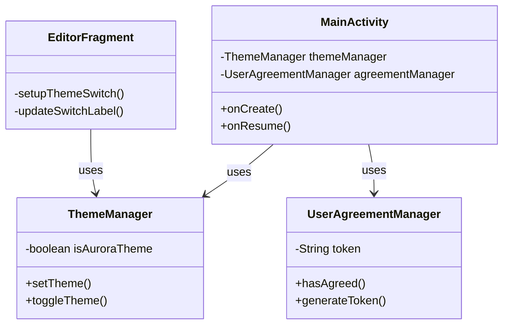
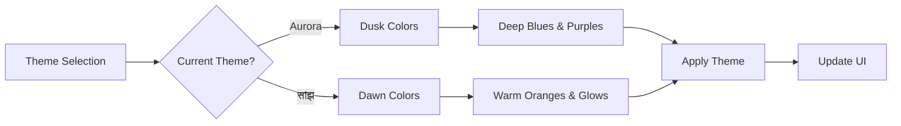
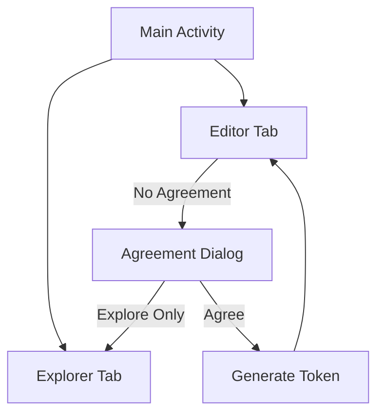

# Bhaksh (भक्ष) - App Overview

## Introduction
Bhaksh (भक्ष) is a modern Android application developed with Kotlin and Material Design. It combines rich user experience with powerful functionality, featuring a unique dual-theme system and robust user management.

## Core Features

### Theme System
The app features two distinct themes representing different times of day:

1. **सांझ (Dawn) Theme**
   - Warm, vibrant color palette inspired by sunrise
   - Primary colors: Warm orange (#FF7E57)
   - Background: Soft warm glow (#FFEBCC)
   - Optimized for morning productivity
   - Default theme of the application

2. **Aurora (Dusk) Theme**
   - Deep, mystical palette inspired by twilight
   - Primary colors: Deep indigo (#5C6BC0)
   - Background: Rich navy (#1A237E)
   - Perfect for evening work
   - Toggleable through the editor interface

### User Agreement System
- Two-tier access system:
  - Explore mode: Available without agreement
  - Editor mode: Requires user agreement
- Generates unique 7-digit token upon agreement
- Persistent user preferences
- Token display in editor tab

## Technical Architecture

### Core Components
1. **User Management**
   - UserAgreementManager
   - Token generation and persistence
   - Access control management

2. **Theme Management**
   - ThemeManager singleton
   - Theme persistence
   - Runtime theme switching

3. **UI Components**
   - Material Design implementation
   - Custom dialog systems
   - Responsive layouts
   - Bottom navigation

### Theme Color Schemes
```mermaid
graph LR
    subgraph सांझ[सांझ Theme - Dawn]
        S1[Primary<br/>#FF7E57] --- S2[Background<br/>#FFEBCC]
        S2 --- S3[Accent<br/>#FFB74D]
        S3 --- S4[Text<br/>#442C2A]
    end
    
    subgraph Aurora[Aurora Theme - Dusk]
        A1[Primary<br/>#5C6BC0] --- A2[Background<br/>#1A237E]
        A2 --- A3[Accent<br/>#B39DDB]
        A3 --- A4[Text<br/>#E8EAF6]
    end
```

### Component Architecture


### Theme Architecture


### Navigation Structure


## Implementation Details

### Theme Implementation
- Material Design 3.0 theming system
- Custom color palettes for each theme
- Dynamic theme switching without app restart
- State persistence using SharedPreferences

### User Agreement Flow
1. First launch: Show agreement dialog
2. User choices:
   - Accept & get token for full access
   - Continue with limited access
3. Token generation using device-specific parameters
4. Persistent storage of agreement status

## Technical Requirements
- Android SDK 33 (Tiramisu) or later
- Kotlin 1.8.0+
- AndroidX components
- Material Design Components
- Minimum Android version: API 24

## Build & Development
- Gradle-based build system
- Android Studio Arctic Fox or later
- JDK 11 or higher required

## Authors
- paneer
- jaat
- svar

## License
This project is proprietary and confidential.