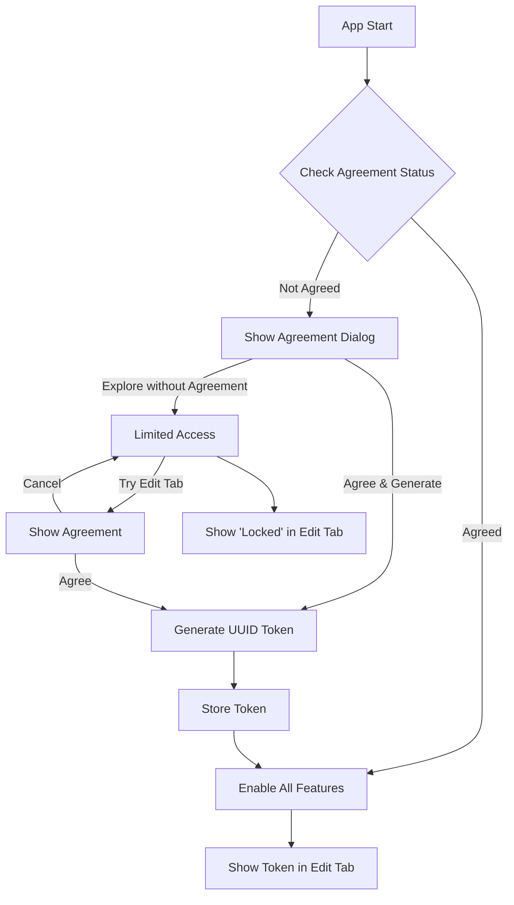

# User Agreement Implementation Plan

## Overview
This document outlines the implementation plan for the user agreement system in the Bhaksh app. The system will manage user consent, generate unique device tokens, and control feature access based on agreement status.

## Flow Diagram

## Implementation Steps

### 1. Agreement Management System

#### SharedPreferences Storage
- Store agreement status (boolean)
- Store generated token (7-digit UUID)
- Implement persistence across app launches

#### UUID Generation
- Create device-specific UUID generator
- Ensure uniqueness based on device parameters
- Format token to 7 digits

#### Agreement Dialog UI
- Create dialog with two options:
  1. "Agree and Generate Token"
  2. "Explore without Agreement"
- Clear explanation of implications for each choice

### 2. Feature Access Control

#### Explore Tab
- Always accessible to all users
- No token requirement
- Full functionality available

#### Edit Tab
- Access restricted to users with agreement
- Show agreement dialog when accessed without token
- Display token/locked status in subtitle

### 3. Token Management

#### Generation
- Create 7-digit UUID based on device uniqueness
- Format consistently
- Handle generation failures

#### Storage
- Secure token storage in SharedPreferences
- Persistence across sessions
- Token validation methods

#### Display
- Show token in Edit tab subtitle (grey color)
- Show "locked" status when no agreement
- Handle UI updates on status changes

### 4. UI Components

#### Agreement Dialog Layout
- Clear title and explanation
- Two distinct action buttons
- Professional appearance
- Error handling display

#### Edit Tab Modifications
- Subtitle text view for token/status
- Grey color for token display
- "Locked" text styling
- Dynamic updates

## Technical Considerations

- Handle configuration changes
- Maintain token persistence
- Secure storage implementation
- Clean architecture principles
- Error handling and edge cases
- UI state management